# SXSW 2018 - Changing the World with Open, Long-Range IoT

Welcome to our session at SXSW 2018. If you have any questions, please just give a shout. We are here to help.

In this session you'll be building five examples, introducing you to:

1. Building IoT devices with [Arm Mbed OS](https://os.mbed.com/).
1. Hooking up an optical particle sensor to a development board.
1. Connecting your device to [The Things Network](https://www.thethingsnetwork.org/) using LoRaWAN.
1. Data visualization of particle sensors.
1. Drawing all sensors on a single map, giving live insight in Austin's pollution numbers.

In case you're stuck this document will help you get back on track. If you're a fast learner, there are 'extra credit'-assignments at the end of each section. Please help your neighbours as well :-)

## Prerequisites

We need to install a few pieces of software that we'll be using.

**Windows**

If you are on Windows, install:

1. [Arm Mbed Windows serial driver](http://os.mbed.com/media/downloads/drivers/mbedWinSerial_16466.exe) - serial driver for the board.
1. [Tera term](https://osdn.net/projects/ttssh2/downloads/66361/teraterm-4.92.exe/) - to see debug messages from the board.
1. [Node.js](https://nodejs.org/en/download/) - to show visualizations.

**Linux**

If you're on Linux, install:

1. screen - e.g. via `sudo apt install screen`
1. [Node.js](https://nodejs.org/en/download/) - to show visualizations.

**MacOS**

If you're on MacOS, install:

1. [Node.js](https://nodejs.org/en/download/) - to show visualizations.

## Building the circuit

We're using the [L-TEK FF1705](https://os.mbed.com/platforms/L-TEK-FF1705/) development board, which contains the Multi-Tech xDot module. In addition you'll have a battery holder, some batteries and an optical particle sensor. Let's connect these sensors and verify that the board works.

Grab the following items:

* Development board.
* Micro-USB cable.
* Optical particle sensor.
* 3x jumper wires.
* A box.
* Battery pack + batteries.

The particle sensor needs to be in the box, because it needs to have consistent lighting. Place the sensor in the box like this (use some velcro):

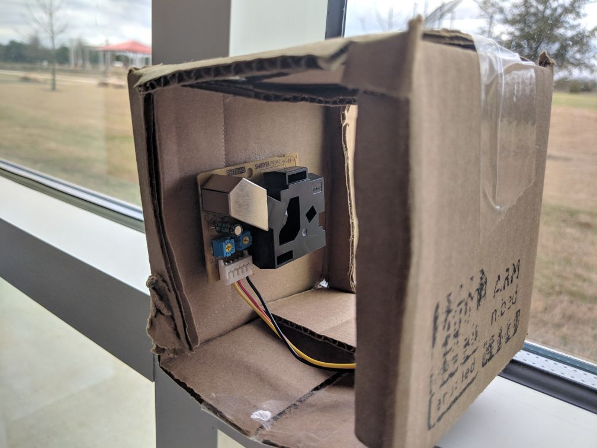

To connect the particle sensor you use the yellow, red and black wires. We'll use the jumper wires to connect the sensor to the board (because we don't have Grove base shields).

Plug the jumper wires into the Grove connector, and connect:

* Red -> 5V
* Black -> GND
* Yellow -> GPIO3

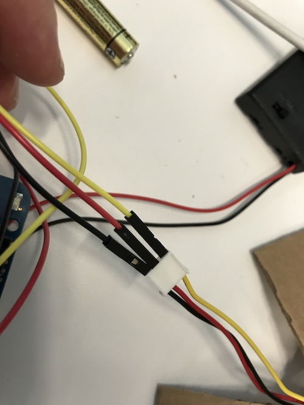 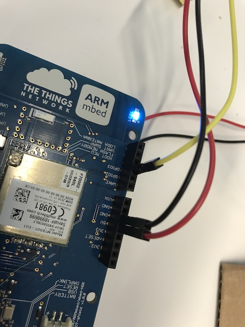

## 1. A simple application

Now let's build a simple application which reads the sensor data and prints it to the serial console. Note that it takes three minutes to get the sensor to warm up!

1. Plug your board into your computer and open its USB device folder.
1. Double click on the .HTM file. (This adds your Mbed platform to the Online Compiler.)
1. Import the example program into the Arm Mbed Compiler by clicking [this link](https://os.mbed.com/compiler/#import:https://github.com/armmbed/sxsw2018).
1. Click *Import*.

    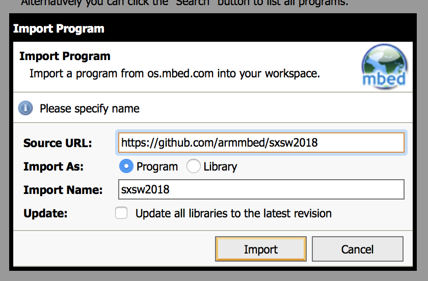

1. In the top right corner make sure you selected 'L-TEK FF1705'.

    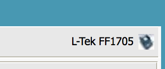

This has cloned the repository. There are a few examples here, so let's switch between them.

1. Open `firmware/select_project.h`.
1. Change the project to `1`.

    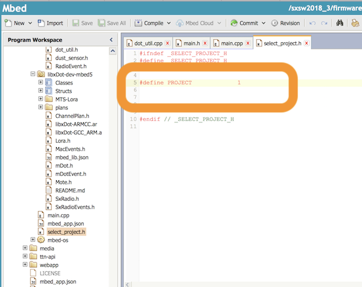

1. To see the code, see `1_blinky/main.cpp`, it's pretty straight forward!
1. Click *Compile*.

    

1. A binary (.bin) file downloads, use drag-and-drop to drag the file to the DAPLINK device (like a USB mass storage device).
1. When flashing is complete, hit the **RESET** button on the board (next to USB).

You should see the blue LED blink very fast. Your first program is running! Let's look at the logs now.

### Extra credit

The LED blinks automatically. But you can also make it user controlled through the push button on the board. To handle events coming from a physical device you can use interrupts. These fire off when the state of a physical switch changes. You can handle them as follows:

```cpp
void fall_handler() {
    // button is pressed
}

void rise_handler() {
    // button is no longer pressed
}

InterruptIn btn(BUTTON1);

int main() {
    btn.fall(&fall_handler);
    btn.rise(&rise_handler);
}
```

Change the code so that the LED responds to the button instead of through a timer.

## 2. Showing logs

If all is well, you should see something similar to:

```
Blink! LED is now 1
Blink! LED is now 0
Blink! LED is now 1
Blink! LED is now 0
Blink! LED is now 1
```

#### Windows

To see debug messages, install:

1. [Arm Mbed Windows serial driver](http://os.mbed.com/media/downloads/drivers/mbedWinSerial_16466.exe) - serial driver for the board.
    * See above for more instructions.
1. [Tera term](https://osdn.net/projects/ttssh2/downloads/66361/teraterm-4.92.exe/) - to see debug messages from the board.

When you open Tera Term, select *Serial*, and then select the Mbed COM port.


#### OS/X

No need to install a driver. Open a terminal and run:

```
screen /dev/tty.usbm            # now press TAB to autocomplete and then ENTER
```

To exit, press: `CTRL+A` then `CTRL+\` then press `y`.

#### Linux

If it's not installed, install GNU screen (`sudo apt-get install screen`). Then open a terminal and find out the handler for your device:

```
$ ls /dev/ttyACM*
/dev/ttyACM0
```

Then connect to the board using screen:

```
sudo screen /dev/ttyACM0 9600                # might not need sudo if set up lsusb rules properly
```

To exit, press `CTRL+A` then type `:quit`.

## 3. Getting data from the dust sensor

Now let's grab some data from the dust sensor. Make sure you've connected it properly to your device, and that it's in an upright position (I feel like I'm an airline steward) in the box.

1. Go into `select_project.h` and change the project to `2`.
1. Inspect the code in `2_dust_sensor/main.cpp`.
1. Hit *Compile* again and drag-and-drop the binary to the board.

Inspect the logs on the device, and see the sensor counting dust particles. Blow into the sensor or spray something around the air to change it around.

### Extra credit

Dust particles is just one of the things we can measure. How about temperature and humidity? We have some extra sensors with us that can do this. Grab one and see if you can change the program so that it measures both dust + temperature + humidity. The component page - which contains drivers and example code - for the sensor is [here](https://os.mbed.com/components/Grove-TempHumi-Sensor/).

### Extra credit (2)

We're blocking the main thread right now while we're waiting for the dust measurement to come in. That gets complicated very quickly when dealing with multiple sensors. To deal with this Mbed contains an RTOS - a real-time operating system - where you can spawn threads. That's very useful in these contexts. To spin up a new thread do this:

```cpp
void new_thread_main() {
    // run your code here
}

Thread new_thread;

int main() {
    new_thread.start(&new_thread_main);
}
```

Change the code so it runs the temperature and humidity measurements in a different thread.

## 4. Connecting to The Things Network

Now it's time to send this data to the internet over LoRaWAN.

1. Open `select_project.h` and change the project to 3.

We need to program some keys in the device. LoRaWAN uses an end-to-end encryption scheme that uses two session keys. The network server holds one key, and the application server holds the other. (In this tutorial, TTN fulfils both roles). These session keys are created when the device joins the network. For the initial authentication with the network, the application needs its device EUI, the EUI of the application it wants to join (referred to as the application EUI) and a preshared key (the application key).

Let's register this device in The Things Network and grab some keys!

### Connecting to The Things Network

#### Setting up

1. Go to [The Things Network Console](https://console.thethingsnetwork.org)
2. Login with your account or click [Create an account](https://account.thethingsnetwork.org/register)

   

   >The Console allows you to manage Applications and Gateways.

3. Click **Applications**
4. Click **Add application**
5. Enter a **Application ID** and **Description**, this can be anything
6. Be sure to select `ttn-handler-us-west` in **Handler registration**

   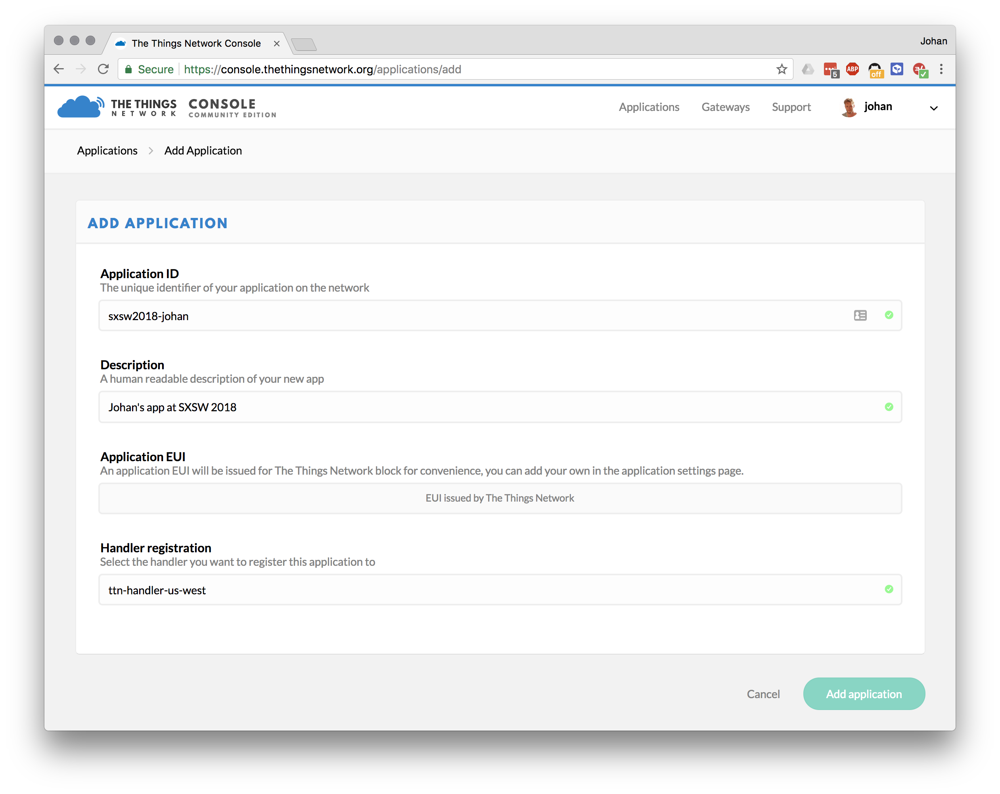

   >The Things Network is a global and distributed network. Selecting the Handler that is closest to you and your gateways allows for higher response times.

7. Click **Add application**

   

   >LoRaWAN devices send binary data to minimize the payload size. This reduces channel utilization and power consumption. Applications, however, like to work with JSON objects or even XML. In order to decode binary payload to an object, The Things Network supports [CayenneLPP](https://www.thethingsnetwork.org/docs/devices/arduino/api/cayennelpp.html) and Payload Functions: JavaScript lambda functions to encode and decode binary payload and JSON objects. In this example, we use CayenneLPP.

8. Go to **Payload Format** and select **CayenneLPP**

   

#### Registering your Device

1. In your application, go to **Devices**
2. Click **register device**
3. Enter a **Device ID**
4. Look very closely at the Multi-Tech xDot on your L-Tek FF1705, the **Device EUI** is printed after **NODE**:

   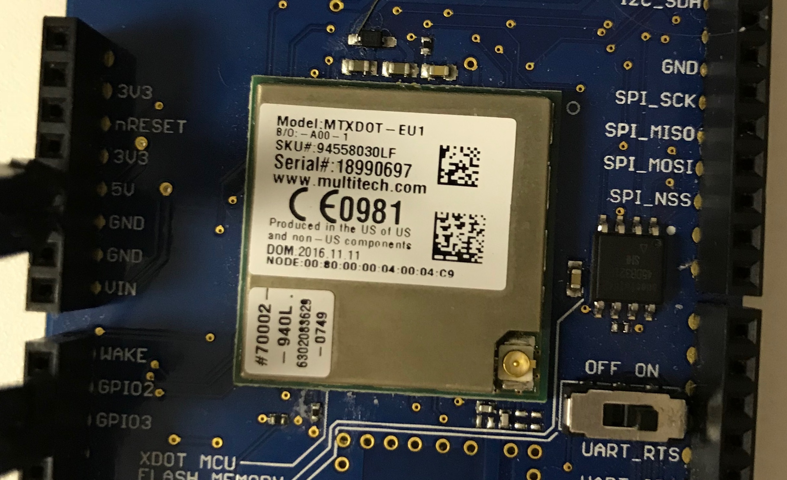

   >The EUI starts with `00:80:00:00:...`. Enter without the colons.

   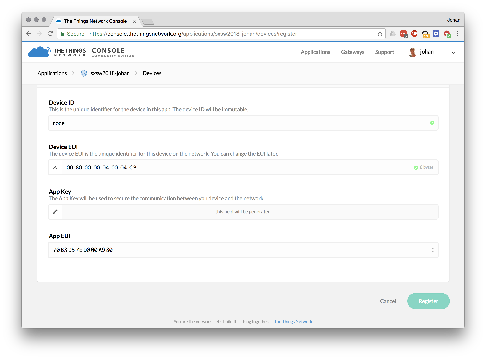

   >You can leave the Application EUI to be generated automatically.

5. Click **Register**

   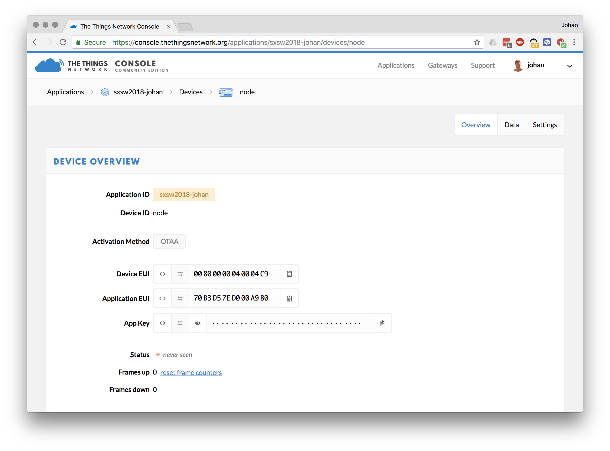

   >Your device needs to be programmed with the **Application EUI** and **App Key**

7. Click the `< >` button of the **Application EUI** and **App Key** values to show the value as C-style array
8. Click the **Copy** button on the right of the value to copy to clipboard

   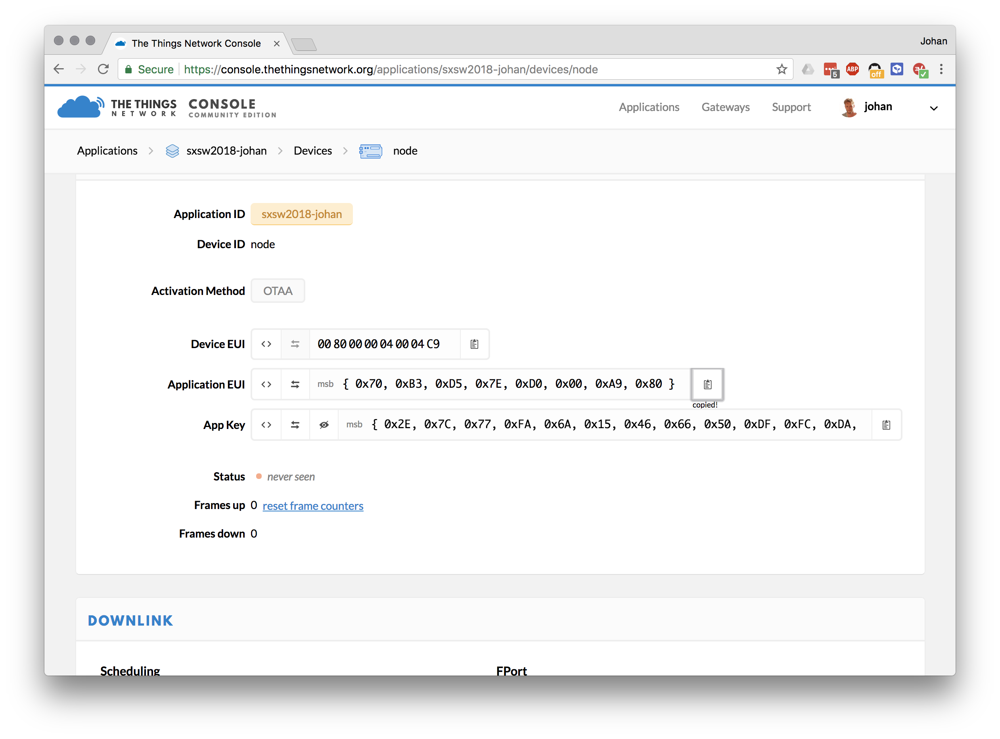

#### Pasting them in the Online Compiler

In the Online Compiler now open `firmware/src/ttn_config.h`, and paste the Application EUI and Application Key in:

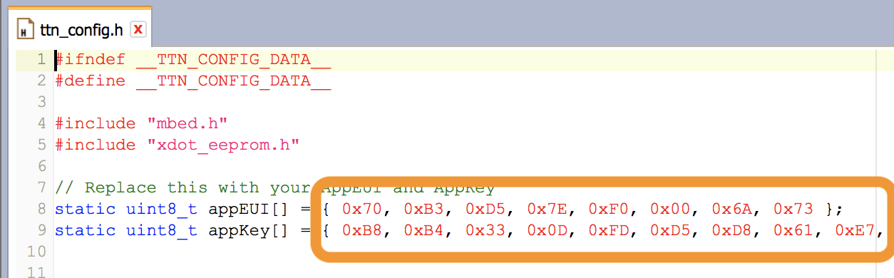

**Note:** Do not forget the `;` after pasting.

Now click *Compile* and flash the application to your board again. The board should now connect to The Things Network. Inspect the *Data* tab in the TTN console to see the device connecting. You should first see a 'join request', then a 'join accept', and then data flowing in.


### Extra credit - relaying data back to the device

We only *send* messages to the network. But you can also relay data back to the device. Note that LoRaWAN devices can only receive messages when a RX window is open. This RX window opens right after a transmission, so you can only relay data back to the device right after sending.

To send some data to the device:

1. Open the device page in the TTN console.
1. Under 'Downlink', enter some data under 'Payload' and click *Send*.
1. Inspect the logs on the device to see the device receive the message - note that messages are not guaranteed to end up at the device. The 'Confirmed' flag can help if this is a necessity.

Now let's do something useful... Control the LED on the board over LoRaWAN.

Look at `RadioEvent.h` to the line where the messages are received. Now change the behavior so that the LED can be controlled through a downlink message.

*Disabling LED sleep behavior*

The LED still turns off when the device goes into sleep. This is a power-saving measurement. To disable sleep behavior for the LED:

1. In `dot_util.cpp` change:

    ```cpp
        if (dot->getWakePin() != GPIO0 || dot->getWakeMode() == mDot::RTC_ALARM) {
            GPIO_InitStruct.Pin = GPIO_PIN_4;
            GPIO_InitStruct.Mode = GPIO_MODE_ANALOG;
            GPIO_InitStruct.Pull = GPIO_NOPULL;
            HAL_GPIO_Init(GPIOA, &GPIO_InitStruct);
        }
    ```

    into:

    ```cpp
        if (dot->getWakePin() != GPIO0 || dot->getWakeMode() == mDot::RTC_ALARM) {
            // GPIO_InitStruct.Pin = GPIO_PIN_4;
            // GPIO_InitStruct.Mode = GPIO_MODE_ANALOG;
            // GPIO_InitStruct.Pull = GPIO_NOPULL;
            // HAL_GPIO_Init(GPIOA, &GPIO_InitStruct);
        }
    ```

1. In `dot_util.cpp` change:

    ```cpp
    // PB_0, PB_1, PB_3 & PB_4 to analog nopull
    GPIO_InitStruct.Pin = GPIO_PIN_0 | GPIO_PIN_1 | GPIO_PIN_3 | GPIO_PIN_4;
    GPIO_InitStruct.Mode = GPIO_MODE_ANALOG;
    GPIO_InitStruct.Pull = GPIO_NOPULL;
    HAL_GPIO_Init(GPIOB, &GPIO_InitStruct);
    ```

    into:

    ```cpp
    // PB_0, PB_1, PB_3 & PB_4 to analog nopull
    GPIO_InitStruct.Pin = GPIO_PIN_0 | GPIO_PIN_1 | GPIO_PIN_3; // | GPIO_PIN_4;
    GPIO_InitStruct.Mode = GPIO_MODE_ANALOG;
    GPIO_InitStruct.Pull = GPIO_NOPULL;
    HAL_GPIO_Init(GPIOB, &GPIO_InitStruct);
    ```

1. Those changes will no longer shut down the LED when the device is asleep.

### Extra credit (2) - Sending temperature and humidity data

Particle count is just one thing. Change the code so that it also sends temperature and humidity data off another sensor. More information can be found in the extra credit section in 3.

CayenneLPP format already knows about temperature and humidity, so you can do:

```cpp
payload.addTemperature(2, 23.21f); // on channel 2, send temperature 23.21 degrees celcius
payload.addRelativeHumidity(3, 48.12f); // on channel 3, send 48.12 humidity
```

## 5. Getting data out of The Things Network

To get some data out of The Things Network you can use their API. Today we'll use the node.js API, but there are many more.

First, you need the application ID, and the application key.

1. Open the TTN console and go to your application.
1. Your application ID is noted on the top, write it down.

    

1. Your application Key is at the bottom of the page. Click the 'show' icon to make it visible and note it down.

    

With these keys we can write a Node.js application that can retrieve data from TTN.

1. Open a terminal or command prompt.
1. Create a new folder:

    ```
    $ mkdir sxsw-ttn-api
    $ cd sxsw-ttn-api
    ```

1. In this folder run:

    ```
    $ npm install ttn blessed blessed-contrib
    ```

1. Create a new file `server.js` in this folder, and add the following content (replace YOUR_APP_ID and YOUR_ACCESS_KEY with the respective values from the TTN console):

    ```js
    let TTN_APP_ID = 'YOUR_APP_ID';
    let TTN_ACCESS_KEY = 'YOUR_ACCESS_KEY';

    const ttn = require('ttn');

    TTN_APP_ID = process.env['TTN_APP_ID'] || TTN_APP_ID;
    TTN_ACCESS_KEY = process.env['TTN_ACCESS_KEY'] || TTN_ACCESS_KEY;

    ttn.data(TTN_APP_ID, TTN_ACCESS_KEY).then(client => {
        client.on('uplink', (devId, payload) => {
            console.log('retrieved uplink message', devId, payload);
        });

        console.log('Connected to The Things Network data channel');
    });
    ```

1. Now run:

    ```
    $ node server.js
    ```

The application authenticates with the The Things Network and receives any message from your device.

**Showing simple graphs**

We can also graph the values directly to the console. Replace `server.js` with:

```js
let TTN_APP_ID = 'YOUR_APP_ID';
let TTN_ACCESS_KEY = 'YOUR_ACCESS_KEY';

const ttn = require('ttn');
const blessed = require('blessed');
const contrib = require('blessed-contrib');
const screen = blessed.screen();
const line = contrib.line({ width: 80, height: 20, left: 0, bottom: 0, xPadding: 5, yPadding: 10, minY: 0, maxY: 5, numYLabels: 7 });

let data = [
    { title: 'Air pollution',
        x: [ ],
        y: [ ],
        style: {
            line: 'red'
        }
    }
];

TTN_APP_ID = process.env['TTN_APP_ID'] || TTN_APP_ID;
TTN_ACCESS_KEY = process.env['TTN_ACCESS_KEY'] || TTN_ACCESS_KEY;

let series = [];

ttn.data(TTN_APP_ID, TTN_ACCESS_KEY).then(client => {
    client.on('uplink', (devId, payload) => {
        // console.log('retrieved uplink message', devId, payload.payload_fields.analog_in_1 * 100);

        data[0].x.push(new Date(payload.metadata.time).toLocaleTimeString().split(' ')[0]);
        data[0].y.push(payload.payload_fields.analog_in_1 * 100);

        line.setData(data);
        screen.render();
    });

    console.log('Connected to The Things Network data channel');
});


screen.append(line); //must append before setting data

screen.key(['escape', 'q', 'C-c'], function(ch, key) {
  return process.exit(0);
});
```

### Extra credit

There's some limitations in our current graph:

1. It only shows a single device at the same time.
1. The graph is drawn in the console.

Some extra credit excercises:

1. Change the application so that it can show multiple devices at the same time.
    * You can achieve this by inspecting `payload.dev_id` - this is the device that the message originated from.
    * Add a new series for every device that you see.
    * Work with your neighbor to get multiple devices in your application (they need to change their keys to your app).
1. Turn this demo into a web application.
    * Node.js + socket.io can be used to push new events down to the browser ([tutorial here](http://www.programwitherik.com/getting-started-with-socket-io-node-js-and-express/)).
    * Send the events from TTN -> your node app -> browser, and graph them in the browser.
1. Storing data.
    * At the moment nothing is stored.
    * Store the data in a file, or in a database and read that back when you start the application.

## 6. A web application to show all your devices

Let's visualize your data in a proper way. We have built a web application that will show all sensors on a map and then graphs the dust count. It works both in your browser and on your phone :-)

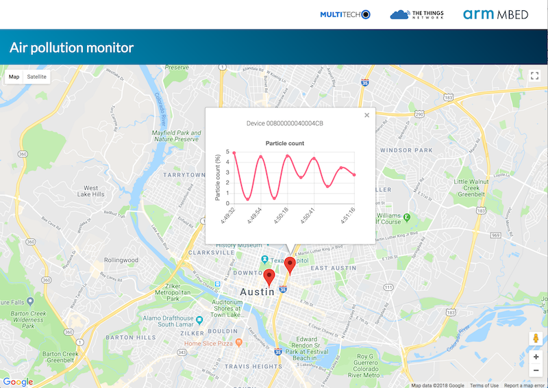

There's two ways you can run this web app, locally, just showing your own data; or you can use the hosted version, where we can show data from all sensors. Let's run it locally first, so you can change things.

1. [Download the repository for this workshop](https://github.com/ARMmbed/sxsw2018/archive/master.zip).
1. Unzip the package.
1. Open a terminal or command prompt and navigate to the folder where you unzip'ed the package.
1. Run:

    ```
    $ cd webapp
    $ npm install
    ```

1. Open `server.js` in the webapp folder.
1. From the terminal, run:

    ```
    $ node server.js
    ```

1. Open your web browser and navigate to http://localhost:5270.
1. On the web page, enter your application ID in the text box and click *Connect*. Then enter your access key to connect.

Sensors should automatically show up now! You can also show sensors from other people, you just need their app ID and access key. Ask your neighbors!

Markers can be dragged around to mark where they are deployed. This is done in sync, open two web browsers, and see markers moving on both sides!

**Extra credit (1) - Marker colors**

The markers are always red. Change the color of the marker depending on current dust levels. You can change the marker icon via:

```js
marker.setIcon('http://maps.google.com/mapfiles/ms/icons/green-dot.png')
```

**Extra credit (2) - Temperature / humidity data**

Remember the temperature and humidity sensors from 3. and 4.? Add that information to the map as well. Look in `maps.js` to see how we do the graphing (it's pretty simple). Data is being sent over a websocket to the browser (see `server.js`). Handle the events and update the graph accordingly.

## 7. Let's build this thing together

We want this data set to be practical, and outlive SXSW! For this purpose we have hosted the web application on a public server. It'd be great if you can all add your device to the map.

1. Go to the TTN console and add a new access key.
1. Go to [the hosted application](http://sxsw2018.thethings.network).
1. On the web page, enter your application ID in the text box and click *Connect*. Then enter your new access key to connect.
1. See the glorious map showing all devices!


Done already? Go do some extra credit work!
