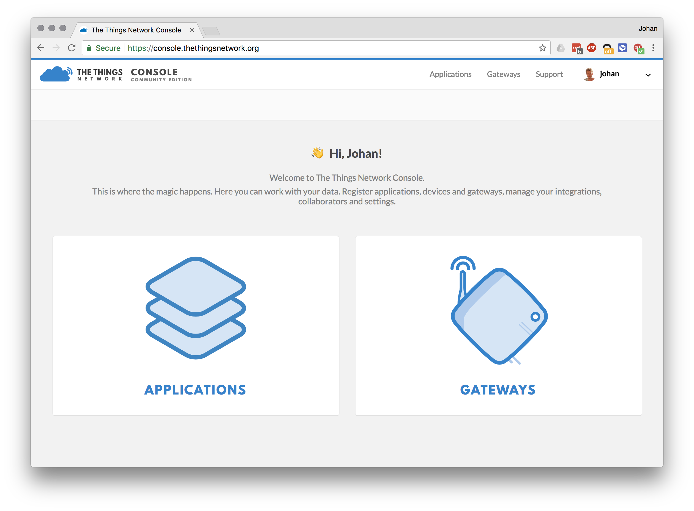
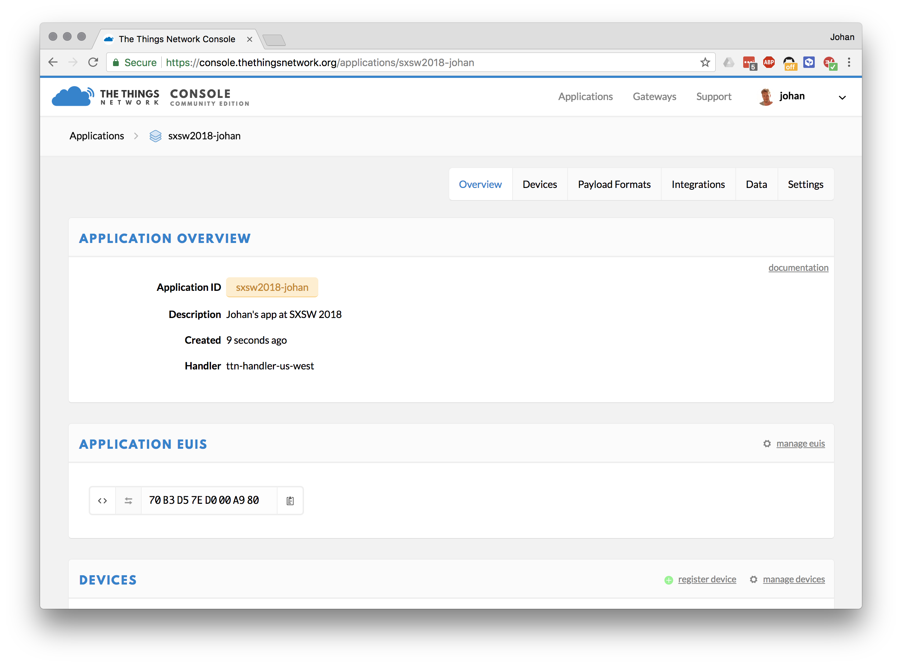
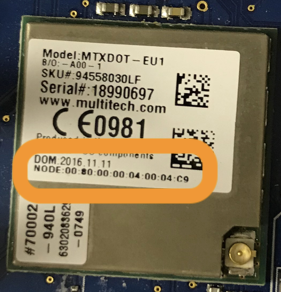

# SXSW 2018 - Changing the World with Open, Long-Range IoT

Welcome to our session at SXSW 2018. If you have any questions, please just give a shout. We are here to help.

In this session you'll be building five examples, introducing you to:

1. Building IoT devices with Arm Mbed.
1. Hooking up an optical particle sensor to a development board.
1. Connecting your device to The Things Network using LoRaWAN.
1. Data visualization of particle sensors.
1. Drawing all sensors on a single map, giving live insight in Austin's pollution numbers.

In case you're stuck this document will help you get back on track. If you're a fast learner, there are 'extra credit'-assignments at the end of each section. Please help your neighbours as well :-)

## Prerequisites

We need to install a few pieces of software that we'll be using.

**Windows**

If you are on Windows, install:

1. [Mbed Windows serial driver](http://os.mbed.com/media/downloads/drivers/mbedWinSerial_16466.exe) - serial driver for the board.
1. [Tera term](https://osdn.net/projects/ttssh2/downloads/66361/teraterm-4.92.exe/) - to see debug messages from the board.
1. [Node.js](https://nodejs.org/en/download/) - to show visualizations.

**Linux**

If you're on Linux, install:

1. screen - e.g. via `sudo apt install screen`
1. [Node.js](https://nodejs.org/en/download/) - to show visualizations.

**MacOS**

1. [Node.js](https://nodejs.org/en/download/) - to show visualizations.

## Building the circuit

We're using the [L-TEK FF1705](https://os.mbed.com/platforms/L-TEK-FF1705/) development board, which contains the Multi-Tech xDot module. In addition you'll have a battery holder, some batteries and an optical particle sensor. Let's connect these sensors and verify that the board works.

Grab:

* Development board.
* Micro-USB cable.
* Optical particle sensor.
* 3x jumper wires.
* A box.

The particle sensor needs to be in the box, because it needs to have consistent lighting. Place the sensor in the box like this (use some velcro):

*Image here*

To connect the particle sensor you use the yellow, red and black wires. We'll use the jumper wires to connect the sensor to the board (because we don't have Grove base shields).

Plug the jumper wires into the Grove connector, and connect:

* Red -> 5V
* Black -> GND
* Yellow -> GPIO2

*Image here*

## 1. A simple application

Now let's build a simple application which reads the sensor data and prints it to the serial console. Note that it takes three minutes to get the sensor to warm up!

1. Go to [https://os.mbed.com](https://os.mbed.com) and sign up (or sign in).
1. Go to the [L-TEK FF1705](https://os.mbed.com/platforms/L-TEK-FF1705/) platform page and click *Add to your Mbed compiler*.

    

1. Go to [mbed-os-example-blinky](https://os.mbed.com/teams/mbed-os-examples/code/mbed-os-example-blinky/) and click *Import into Compiler*.

    

1. The compiler opens.
1. In the top right corner make sure you selected 'L-TEK FF1705'.

    

1. Now open `main.cpp`, and replace the content with:

    ```cpp
    ...
    ```

1. Click *Compile*.

    

1. A file downloads, use drag-and-drop to drag the file to the DAPLINK device (like a USB mass storage device).
1. When flashing is complete, hit the **RESET** button on the board (next to USB).

Now when you XXX, you should see the blue LED light up. Let's look at the logs now.

## 2. Showing logs

If all is well, you should see something similar to:

```
...
```

#### Windows

To see debug messages, install:

1. [Mbed Windows serial driver](http://os.mbed.com/media/downloads/drivers/mbedWinSerial_16466.exe) - serial driver for the board.
    * See above for more instructions.
1. [Tera term](https://osdn.net/projects/ttssh2/downloads/66361/teraterm-4.92.exe/) - to see debug messages from the board.

When you open Tera Term, select *Serial*, and then select the Mbed COM port.


#### OS/X

No need to install a driver. Open a terminal and run:

```
screen /dev/tty.usbm            # now press TAB to autocomplete and then ENTER
```

To exit, press: `CTRL+A` then `CTRL+\` then press `y`.

#### Linux

If it's not installed, install GNU screen (`sudo apt-get install screen`). Then open a terminal and find out the handler for your device:

```
$ ls /dev/ttyACM*
/dev/ttyACM0
```

Then connect to the board using screen:

```
sudo screen /dev/ttyACM0 9600                # might not need sudo if set up lsusb rules properly
```

To exit, press `CTRL+A` then type `:quit`.

## 3. Importing the LoRaWAN example

Now it's time to connect your device to the internet over LoRaWAN. For this we prepared an example application already which you can import in the online compiler.

1. Go back to the Online Compiler.
1. Click *Import > Click here to import from URL*.
1. Enter `https://github.com/armmbed/sxsw2018`.
1. Click *Import*.

    

Now we need to program some keys in the device. LoRaWAN uses an end-to-end encryption scheme that uses two session keys. The network server holds one key, and the application server holds the other. (In this tutorial, TTN fulfils both roles). These session keys are created when the device joins the network. For the initial authentication with the network, the application needs its device EUI, the EUI of the application it wants to join (referred to as the application EUI) and a preshared key (the application key).

Let's register this device in The Things Network and grab some keys!

## Connecting to The Things Network

### Setting up

1. Go to [The Things Network Console](https://console.thethingsnetwork.org)
2. Login with your account or click [Create an account](https://account.thethingsnetwork.org/register)

   

   >The Console allows you to manage Applications and Gateways.

3. Click **Applications**
4. Click **Add application**
5. Enter a **Application ID** and **Description**, this can be anything
6. Be sure to select `ttn-handler-us-west` in **Handler registration**

   

   >The Things Network is a global and distributed network. Selecting the Handler that is closest to you and your gateways allows for higher response times.

7. Click **Add application**

   

   >LoRaWAN devices send binary data to minimize the payload size. This reduces channel utilization and power consumption. Applications, however, like to work with JSON objects or even XML. In order to decode binary payload to an object, The Things Network supports [CayenneLPP](https://www.thethingsnetwork.org/docs/devices/arduino/api/cayennelpp.html) and Payload Functions: JavaScript lambda functions to encode and decode binary payload and JSON objects. In this example, we use CayenneLPP.

8. Go to **Payload Format** and select **CayenneLPP**

   

### Registering your Device

1. In your application, go to **Devices**
2. Click **register device**
3. Enter a **Device ID**
4. Look very closely at the Multi-Tech xDot on your L-Tek FF1705, the **Device EUI** is printed after **NODE**:

   

   >The EUI starts with `00:80:00:00:...`. Enter without the colons.

   

   >You can leave the Application EUI to be generated automatically.

5. Click **Register**

   

   >Your device needs to be programmed with the **Application EUI** and **App Key**

7. Click the `< >` button of the **Application EUI** and **App Key** values to show the value as C-style array
8. Click the **Copy** button on the right of the value to copy to clipboard

   

### Pasting them in the Online Compiler

In the Online Compiler now open `firmware/src/ttn_config.h`, and paste the Application EUI and Application Key in:


**Note:** Do not forget the `;` after pasting.

Now click *Compile* and flash the application to your board again. The board should now connect to The Things Network. Inspect the *Data* tab in the TTN console to see the device connecting.

## 4. Getting data out of The Things Network

To get some data out of The Things Network you can use their API. Today we'll use the node.js API, but there are many more.

First, you need the application ID, and the application key.

1. Open the TTN console and go to your application.
1. Your application ID is noted on the top, write it down.

    

1. Your application Key is at the bottom of the page. Click the 'show' icon to make it visible and note it down.

    

With these keys we can write a Node.js application that can retrieve data from TTN.

1. Open a terminal or command prompt.
1. Create a new folder:

    ```
    $ mkdir sxsw-ttn-api blessed blessed-contrib
    ```

1. In this folder run:

    ```
    $ npm install ttn
    ```

1. Create a new file `server.js` in this folder, and add the following content (replace YOUR_APP_ID and YOUR_ACCESS_KEY with the respective values from the TTN console):

    ```js
    let TTN_APP_ID = 'YOUR_APP_ID';
    let TTN_ACCESS_KEY = 'YOUR_ACCESS_KEY';

    const ttn = require('ttn');

    TTN_APP_ID = process.env['TTN_APP_ID'] || TTN_APP_ID;
    TTN_ACCESS_KEY = process.env['TTN_ACCESS_KEY'] || TTN_APP_ID;

    ttn.data(TTN_APP_ID, TTN_ACCESS_KEY).then(client => {
        client.on('uplink', (devId, payload) => {
            console.log('retrieved uplink message', devId, payload);
        });

        console.log('Connected to The Things Network data channel');
    });
    ```

1. Now run:

    ```
    $ node server.js
    ```

The application authenticates with the The Things Network and receives any message from your device.

**Showing simple graphs**

We can also graph the values directly to the console. Replace `server.js` with:

```js
let TTN_APP_ID = 'YOUR_APP_ID';
let TTN_ACCESS_KEY = 'YOUR_ACCESS_KEY';

const ttn = require('ttn');
const blessed = require('blessed');
const contrib = require('blessed-contrib');
const screen = blessed.screen();
const line = contrib.line({ width: 80, height: 20, left: 0, bottom: 0, xPadding: 5, yPadding: 10, minY: 0, maxY: 5, numYLabels: 7 });

let data = [
    { title: 'Air pollution',
        x: [ ],
        y: [ ],
        style: {
            line: 'red'
        }
    }
];

TTN_APP_ID = process.env['TTN_APP_ID'] || TTN_APP_ID;
TTN_ACCESS_KEY = process.env['TTN_ACCESS_KEY'] || TTN_APP_ID;

let series = [];

ttn.data(TTN_APP_ID, TTN_ACCESS_KEY).then(client => {
    client.on('uplink', (devId, payload) => {
        // console.log('retrieved uplink message', devId, payload);

        data[0].x.push(new Date(payload.metadata.time).toLocaleTimeString().split(' ')[0]);
        data[0].y.push(payload.payload_fields.analog_in_1);

        line.setData(data);
        screen.render();
    });

    console.log('Connected to The Things Network data channel');
});


screen.append(line); //must append before setting data

screen.key(['escape', 'q', 'C-c'], function(ch, key) {
  return process.exit(0);
});
```

**Extra credit**

There's some limitations in our current graph:

1. It only shows a single device at the same time.
1. The graph is drawn in the console.

Some extra credit excercises:

1. Change the application so that it can show multiple devices at the same time.
    * You can achieve this by inspecting `payload.dev_id` - this is the device that the message originated from.
    * Add a new series for every device that you see.
    * Work with your neighbor to get multiple devices in your application (they need to change their keys to your app).
1. Turn this demo into a web application.
    * Node.js + socket.io can be used to push new events down to the browser ([tutorial here](http://www.programwitherik.com/getting-started-with-socket-io-node-js-and-express/)).
    * Send the events from TTN -> your node app -> browser, and graph them in the browser.
1. Storing data.
    * At the moment nothing is stored.
    * Store the data in a file, or in a database and read that back when you start the application.

## Extra credit

### Relaying data back to the device

We only *send* messages to the network. But you can also relay data back to the device. Note that LoRaWAN devices can only receive messages when a RX window is open. This RX window opens right after a transmission, so you can only relay data back to the device right after sending.

To send some data to the device:

1. Open the device page in the TTN console.
1. Under 'Downlink', enter some data under 'Payload' and click *Send*.
1. Inspect the logs on the device to see the device receive the message - note that messages are not guaranteed to end up at the device. The 'Confirmed' flag can help if this is a necessity.

Now let's do something useful... Control the LED on the board over LoRaWAN.

First, we need to disable sleep behavior for the LED, because currently it always goes off when the device is asleep.

1. In `dot_util.cpp` change:

    ```cpp
        if (dot->getWakePin() != GPIO0 || dot->getWakeMode() == mDot::RTC_ALARM) {
            GPIO_InitStruct.Pin = GPIO_PIN_4;
            GPIO_InitStruct.Mode = GPIO_MODE_ANALOG;
            GPIO_InitStruct.Pull = GPIO_NOPULL;
            HAL_GPIO_Init(GPIOA, &GPIO_InitStruct);
        }
    ```

    into:

    ```cpp
        if (dot->getWakePin() != GPIO0 || dot->getWakeMode() == mDot::RTC_ALARM) {
            // GPIO_InitStruct.Pin = GPIO_PIN_4;
            // GPIO_InitStruct.Mode = GPIO_MODE_ANALOG;
            // GPIO_InitStruct.Pull = GPIO_NOPULL;
            // HAL_GPIO_Init(GPIOA, &GPIO_InitStruct);
        }
    ```

1. In `dot_util.cpp` change:

    ```cpp
    // PB_0, PB_1, PB_3 & PB_4 to analog nopull
    GPIO_InitStruct.Pin = GPIO_PIN_0 | GPIO_PIN_1 | GPIO_PIN_3 | GPIO_PIN_4;
    GPIO_InitStruct.Mode = GPIO_MODE_ANALOG;
    GPIO_InitStruct.Pull = GPIO_NOPULL;
    HAL_GPIO_Init(GPIOB, &GPIO_InitStruct);
    ```

    into:

    ```cpp
    // PB_0, PB_1, PB_3 & PB_4 to analog nopull
    GPIO_InitStruct.Pin = GPIO_PIN_0 | GPIO_PIN_1 | GPIO_PIN_3; // | GPIO_PIN_4;
    GPIO_InitStruct.Mode = GPIO_MODE_ANALOG;
    GPIO_InitStruct.Pull = GPIO_NOPULL;
    HAL_GPIO_Init(GPIOB, &GPIO_InitStruct);
    ```

1. Those changes will no longer shut down the LED when the device is asleep.

Now look at `RadioEvent.h` to the line where the messages are received. Now change the behavior so that the LED can be controlled through a downlink message.
